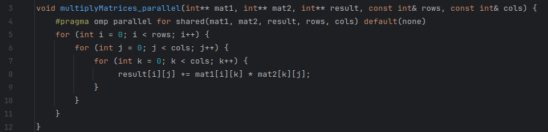
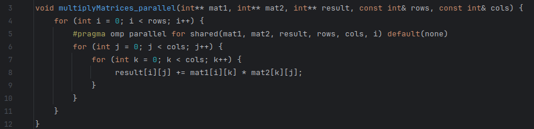
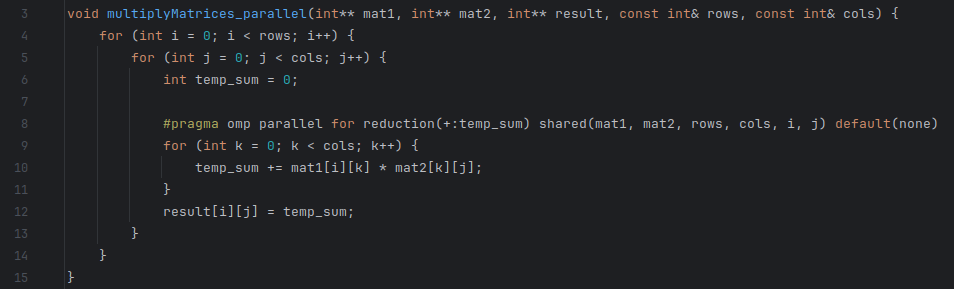
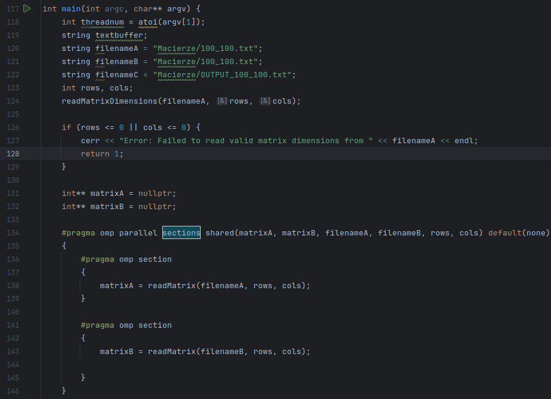
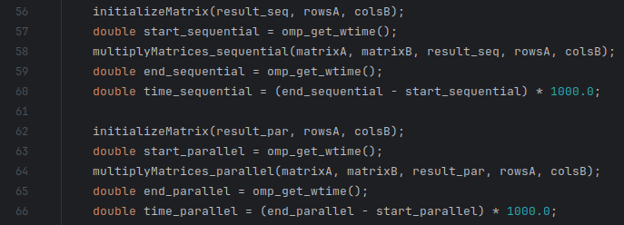

# Sprawozdanie: Równoległe Mnożenie Macierzy z OpenMP

## Specyfikacja Systemu Testowego

*   **Procesor:** AMD Ryzen 5 5600H with Radeon Graphics (6 rdzeni / 12 wątków), Architektura Zen 3, 7nm, Max Freq: 4.280 GHz
*   **Pamięć RAM:** 32GB
*   **Pamięć SSD:** 1TB
*   **System Operacyjny:** Fedora Linux 40 (Workstation Edition)
*   **Jądro:** 6.13.6-100.fc40.x86_64
*   **Kompilator:** g++ (GCC) 14.2.1 20240912 (Red Hat 14.2.1-3)
*   **Opcje kompilacji:** `-Wall -O2 -std=c++11 -fopenmp`

## Metodologia

1.  **Implementacja:** Stworzono funkcję do sekwencyjnego mnożenia macierzy oraz trzy warianty funkcji równoległej:
    *   **Pętla 1 (L1):** Zrównoleglenie zewnętrznej pętli `for` (po indeksie `i`) przy użyciu `#pragma omp parallel for`.
     
    * **Pętla 2 (L2):** Zrównoleglenie środkowej pętli `for` (po indeksie `j`) przy użyciu `#pragma omp parallel for` wewnątrz pętli `i`.
      
    * **Pętla 3 (L3):** Zrównoleglenie wewnętrznej pętli `for` (po indeksie `k`) przy użyciu `#pragma omp parallel for reduction(+:temp_sum)` wewnątrz pętli `i` oraz `j`.
    
    * **Zrównoleglenie czytania plików:**
    
2. **Pomiary Czasu:** Użyto funkcji `omp_get_wtime()` do zmierzenia czasu wykonania mnożenia. Czas prezentowany jest w milisekundach (ms).

    
4. **Parametry Testów:** Przeprowadzono testy dla wszystkich kombinacji:
    *   **Rozmiary Macierzy:** 100, 500, 1000, 2000.
    *   **Liczba Wątków:** 2, 4, 8, 16.
    *   **Strategie Szeregowania (`schedule`):** Domyślne (`static`), `static` (chunk 10, 50, 100), `dynamic` (chunk 10, 50, 100), `guided` (chunk 10, 50, 100).

## Wyniki Pomiarów

### Czas Wykonania Sekwencyjnego

| Rozmiar Macierzy | Czas Sekwencyjny (ms) |
| :--------------- | :-------------------- |
| 100x100          | ~0.5 ms               |
| 500x500          | ~94 ms                |
| 1000x1000         | ~860 ms               |
| 2000x2000         | ~12900 ms             |

*(Powyższe wartości są przybliżonymi średnimi z dostarczonych logów. Można je uściślić.)*

### Czasy Wykonania Równoległego

Wyniki przedstawiono w formacie: **Czas (ms) (Weryfikacja)**, gdzie Weryfikacja to **M** (Match - zgodne), **F** (Fail/MISMATCH - niezgodne) lub **?** (brak weryfikacji w logu).

#### Harmonogram: **Domyślny (Static)**

| Rozmiar   | Wątki: 2 | Wątki: 4 | Wątki: 8 | Wątki: 16 |
| :-------- | :--: | :--: | :--: | :--: |
| **100x100** | L1: 0.4 (M) L2: 0.4 (M) L3: 4.7 (M) | L1: 0.3 (M) L2: 0.3 (M) L3: 5.3 (M) | L1: 0.3 (M) L2: 0.4 (M) L3: 8.7 (M) | L1: 0.5 (M) L2: 4.7 (M) L3: 370.9 (M) |
| **500x500** | L1: 48.6 (M) L2: 46.0 (M) L3: 156.4 (M) | L1: 25.0 (M) L2: 25.2 (M) L3: 157.8 (M) | L1: 25.5 (M) L2: 23.5 (M) L3: 234.5 (M) | L1: 20.0 (M) L2: 47.1 (M) L3: 9145.4 (M) |
| **1000x1000** | L1: 423.0 (M) L2: 399.5 (M) L3: 814.6 (M) | L1: 227.9 (M) L2: 205.2 (M) L3: 695.9 (M) | L1: 161.9 (M) L2: 208.1 (M) L3: 858.2 (M) | L1: 144.6 (M) L2: 233.1 (M) L3: 37249.5 (M) |
| **2000x2000** | L1: 6229.6 (M) L2: 6215.3 (M) L3: 7061.8 (M) | L1: 2803.1 (M) L2: 3249.5 (M) L3: 4251.9 (M) | L1: 2140.7 (M) L2: 3295.9 (M) L3: 4752.1 (M) | L1: 2196.6 (M) L2: 2667.4 (M) L3: 172222.0 (M) |

#### Harmonogram: **Static, chunk 10**

| Rozmiar   | Wątki: 2 | Wątki: 4 | Wątki: 8 | Wątki: 16 |
| :-------- | :--: | :--: | :--: | :--: |
| **100x100** | L1: 0.4 (M) L2: 0.6 (M) L3: 4.7 (M) | L1: 0.3 (M) L2: 0.3 (M) L3: 5.2 (M) | L1: 0.4 (M) L2: 0.4 (M) L3: 8.5 (M) | L1: 0.5 (M) L2: 4.8 (M) L3: 365.8 (M) |
| **500x500** | L1: 48.9 (M) L2: 47.9 (M) L3: 146.4 (M) | L1: 24.0 (M) L2: 24.3 (M) L3: 156.0 (M) | L1: 25.3 (M) L2: 23.8 (M) L3: 227.4 (M) | L1: 19.2 (M) L2: 44.9 (M) L3: 9122.5 (M) |
| **1000x1000** | L1: 427.1 (M) L2: 404.0 (M) L3: 786.7 (M) | L1: 222.8 (M) L2: 202.5 (M) L3: 648.4 (M) | L1: 161.4 (M) L2: 199.7 (M) L3: 862.3 (M) | L1: 154.2 (M) L2: 230.6 (M) L3: 37395.3 (M) |
| **2000x2000** | L1: 6302.1 (M) L2: 5836.0 (M) L3: 6921.3 (M) | L1: 2859.0 (M) L2: 2684.1 (M) L3: 3847.5 (M) | L1: 2146.8 (M) L2: 3532.6 (M) L3: 5815.5 (M) | L1: 2169.4 (M) L2: 2638.8 (M) L3: 169699.0 (M) |

#### Harmonogram: **Static, chunk 50**

| Rozmiar   | Wątki: 2 | Wątki: 4 | Wątki: 8 | Wątki: 16 |
| :-------- | :--: | :--: | :--: | :--: |
| **100x100** | L1: 0.4 (M) L2: 0.4 (M) L3: 5.0 (M) | L1: 0.3 (M) L2: 0.3 (M) L3: 5.2 (M) | L1: 0.3 (M) L2: 0.4 (M) L3: 9.0 (M) | L1: 0.5 (M) L2: 4.4 (M) L3: 358.5 (M) |
| **500x500** | L1: 46.5 (M) L2: 50.0 (M) L3: 150.3 (M) | L1: 23.7 (M) L2: 24.9 (M) L3: 157.4 (M) | L1: 21.1 (M) L2: 25.1 (M) L3: 232.0 (M) | L1: 18.9 (M) L2: 44.8 (M) L3: 9210.3 (M) |
| **1000x1000** | L1: 429.6 (M) L2: 403.4 (M) L3: 797.6 (M) | L1: 222.9 (M) L2: 203.1 (M) L3: 659.6 (M) | L1: 162.8 (M) L2: 223.2 (M) L3: 858.9 (M) | L1: 147.1 (M) L2: 231.2 (M) L3: 37587.6 (M) |
| **2000x2000** | L1: 6378.4 (M) L2: 5994.4 (M) L3: 6839.0 (M) | L1: 2875.2 (M) L2: 3226.1 (M) L3: 4105.6 (M) | L1: 2333.1 (M) L2: 3480.0 (M) L3: 4454.9 (M) | L1: 2401.9 (M) L2: 2668.8 (M) L3: 174474.0 (M) |

#### Harmonogram: **Static, chunk 100**

| Rozmiar   | Wątki: 2 | Wątki: 4 | Wątki: 8 | Wątki: 16 |
| :-------- | :--: | :--: | :--: | :--: |
| **100x100** | L1: 0.4 (M) L2: 0.4 (M) L3: 4.6 (M) | L1: 0.3 (M) L2: 0.3 (M) L3: 5.2 (M) | L1: 0.3 (M) L2: 0.4 (M) L3: 8.7 (M) | L1: 0.5 (M) L2: 4.6 (M) L3: 363.8 (M) |
| **500x500** | L1: 47.0 (M) L2: 48.2 (M) L3: 149.3 (M) | L1: 24.7 (M) L2: 24.6 (M) L3: 155.4 (M) | L1: 26.1 (M) L2: 25.0 (M) L3: 223.0 (M) | L1: 18.5 (M) L2: 44.9 (M) L3: 9266.9 (M) |
| **1000x1000** | L1: 424.4 (M) L2: 402.4 (M) L3: 805.6 (M) | L1: 217.2 (M) L2: 202.5 (M) L3: 650.9 (M) | L1: 163.4 (M) L2: 225.0 (M) L3: 869.3 (M) | L1: 145.2 (M) L2: 235.3 (M) L3: 37667.0 (M) |
| **2000x2000** | L1: 6305.3 (M) L2: 5419.1 (M) L3: 6671.0 (M) | L1: 2837.7 (M) L2: 2769.9 (M) L3: 3916.0 (M) | L1: 2191.8 (M) L2: 3338.2 (M) L3: 5312.5 (M) | L1: 2324.7 (M) L2: 2721.2 (M) L3: 186822.0 (M) |

#### Harmonogram: **Dynamic, chunk 10**

| Rozmiar   | Wątki: 2 | Wątki: 4 | Wątki: 8 | Wątki: 16 |
| :-------- | :--: | :--: | :--: | :--: |
| **100x100** | L1: 0.4 (M) L2: 0.4 (M) L3: 4.7 (M) | L1: 0.2 (M) L2: 0.3 (M) L3: 5.3 (M) | L1: 0.4 (M) L2: 0.4 (M) L3: 7.6 (M) | L1: 0.5 (M) L2: 4.6 (M) L3: 359.8 (M) |
| **500x500** | L1: 47.1 (M) L2: 47.4 (M) L3: 155.2 (M) | L1: 24.9 (M) L2: 23.5 (M) L3: 156.8 (M) | L1: 25.3 (M) L2: 25.1 (M) L3: 244.4 (M) | L1: 19.6 (M) L2: 54.0 (M) L3: 9277.4 (M) |
| **1000x1000** | L1: 431.9 (M) L2: 396.8 (M) L3: 785.2 (M) | L1: 213.5 (M) L2: 217.1 (M) L3: 650.8 (M) | L1: 166.9 (M) L2: 223.1 (M) L3: 852.5 (M) | L1: 152.3 (M) L2: 235.5 (M) L3: 41841.8 (M) |
| **2000x2000** | L1: 6377.6 (M) L2: 6562.3 (M) L3: 6604.2 (M) | L1: 2961.6 (M) L2: 2805.5 (M) L3: 3769.6 (M) | L1: 2253.4 (M) L2: 3460.3 (M) L3: 4702.1 (M) | L1: 2186.8 (M) L2: 2687.6 (M) L3: 169549.0 (M) |

#### Harmonogram: **Dynamic, chunk 50**

| Rozmiar   | Wątki: 2 | Wątki: 4 | Wątki: 8 | Wątki: 16 |
| :-------- | :--: | :--: | :--: | :--: |
| **100x100** | L1: 0.3 (M) L2: 0.4 (M) L3: 4.9 (M) | L1: 0.3 (M) L2: 0.3 (M) L3: 5.0 (M) | L1: 0.3 (M) L2: 0.4 (M) L3: 8.4 (M) | L1: 0.5 (M) L2: 4.5 (M) L3: 358.8 (M) |
| **500x500** | L1: 46.6 (M) L2: 47.6 (M) L3: 147.6 (M) | L1: 24.1 (M) L2: 24.9 (M) L3: 147.3 (M) | L1: 26.0 (M) L2: 25.1 (M) L3: 245.8 (M) | L1: 19.1 (M) L2: 50.6 (M) L3: 9304.6 (M) |
| **1000x1000** | L1: 432.8 (M) L2: 399.9 (M) L3: 815.8 (M) | L1: 217.8 (M) L2: 202.1 (M) L3: 689.4 (M) | L1: 169.2 (M) L2: 222.5 (M) L3: 858.6 (M) | L1: 156.5 (M) L2: 235.7 (M) L3: 40798.7 (M) |
| **2000x2000** | L1: 6538.2 (M) L2: 6542.8 (M) L3: 6621.7 (M) | L1: 2870.7 (M) L2: 2834.5 (M) L3: 4026.0 (M) | L1: 2206.7 (M) L2: 3517.9 (M) L3: 4930.1 (M) | L1: 2113.5 (M) L2: 2715.0 (M) L3: 168030.0 (M) |

#### Harmonogram: **Dynamic, chunk 100**

| Rozmiar   | Wątki: 2 | Wątki: 4 | Wątki: 8 | Wątki: 16 |
| :-------- | :--: | :--: | :--: | :--: |
| **100x100** | L1: 0.4 (M) L2: 0.4 (M) L3: 4.7 (M) | L1: 0.3 (M) L2: 0.3 (M) L3: 5.4 (M) | L1: 0.5 (M) L2: 0.4 (M) L3: 8.3 (M) | L1: 0.6 (M) L2: 4.8 (M) L3: 366.9 (M) |
| **500x500** | L1: 47.4 (M) L2: 46.0 (M) L3: 145.9 (M) | L1: 24.7 (M) L2: 24.6 (M) L3: 151.5 (M) | L1: 26.8 (M) L2: 23.8 (M) L3: 241.1 (M) | L1: 19.3 (M) L2: 45.8 (M) L3: 13220.0 (M) |
| **1000x1000** | L1: 428.7 (M) L2: 403.5 (M) L3: 790.6 (M) | L1: 217.1 (M) L2: 212.5 (M) L3: 653.8 (M) | L1: 167.6 (M) L2: 229.3 (M) L3: 837.2 (M) | L1: 151.2 (M) L2: 236.8 (M) L3: 39912.4 (M) |
| **2000x2000** | L1: 6212.4 (M) L2: 6510.6 (M) L3: 6897.2 (M) | L1: 2874.7 (M) L2: 2699.1 (M) L3: 3777.3 (M) | L1: 2266.4 (M) L2: 3348.5 (M) L3: 4252.0 (M) | L1: 2360.7 (M) L2: 2624.3 (M) L3: 171205.0 (M) |

#### Harmonogram: **Guided, chunk 10**

| Rozmiar   | Wątki: 2 | Wątki: 4 | Wątki: 8 | Wątki: 16 |
| :-------- | :--: | :--: | :--: | :--: |
| **100x100** | L1: 0.4 (M) L2: 0.4 (M) L3: 4.6 (M) | L1: 0.3 (M) L2: 0.3 (M) L3: 5.0 (M) | L1: 0.4 (M) L2: 0.4 (M) L3: 8.1 (M) | L1: 0.5 (M) L2: 4.5 (M) L3: 358.5 (M) |
| **500x500** | L1: 49.6 (M) L2: 47.0 (M) L3: 153.9 (M) | L1: 25.2 (M) L2: 24.7 (M) L3: 142.4 (M) | L1: 23.2 (M) L2: 24.1 (M) L3: 242.2 (M) | L1: 19.1 (M) L2: 47.1 (M) L3: 9262.6 (M) |
| **1000x1000** | L1: 428.7 (M) L2: 403.0 (M) L3: 812.2 (M) | L1: 214.6 (M) L2: 201.7 (M) L3: 674.4 (M) | L1: 161.8 (M) L2: 222.5 (M) L3: 853.4 (M) | L1: 154.7 (M) L2: 230.3 (M) L3: 42690.2 (M) |
| **2000x2000** | L1: 6261.3 (M) L2: 5845.7 (M) L3: 6674.5 (M) | L1: 2893.4 (M) L2: 2665.5 (M) L3: 3555.5 (M) | L1: 2249.6 (M) L2: 3554.0 (M) L3: 5159.9 (M) | L1: 2111.9 (M) L2: 2612.4 (M) L3: 169262.0 (M) |

#### Harmonogram: **Guided, chunk 50**

| Rozmiar   | Wątki: 2 | Wątki: 4 | Wątki: 8 | Wątki: 16 |
| :-------- | :--: | :--: | :--: | :--: |
| **100x100** | L1: 0.4 (M) L2: 0.4 (M) L3: 4.8 (M) | L1: 0.3 (M) L2: 0.3 (M) L3: 5.3 (M) | L1: 0.3 (M) L2: 0.4 (M) L3: 8.4 (M) | L1: 0.5 (M) L2: 5.3 (M) L3: 368.5 (M) |
| **500x500** | L1: 47.5 (M) L2: 45.4 (M) L3: 153.2 (M) | L1: 25.0 (M) L2: 24.0 (M) L3: 158.7 (M) | L1: 25.7 (M) L2: 24.0 (M) L3: 239.0 (M) | L1: 19.4 (M) L2: 47.6 (M) L3: 9303.7 (M) |
| **1000x1000** | L1: 433.4 (M) L2: 395.7 (M) L3: 780.3 (M) | L1: 217.3 (M) L2: 200.2 (M) L3: 669.3 (M) | L1: 167.3 (M) L2: 210.1 (M) L3: 853.7 (M) | L1: 150.5 (M) L2: 236.7 (M) L3: 42760.4 (M) |
| **2000x2000** | L1: 6214.6 (M) L2: 6487.5 (M) L3: 6613.1 (M) | L1: 2876.6 (M) L2: 2632.6 (M) L3: 3931.0 (M) | L1: 2383.8 (M) L2: 3479.8 (M) L3: 5231.8 (M) | L1: 2183.0 (M) L2: 2636.8 (M) L3: 179195.0 (M) |

#### Harmonogram: **Guided, chunk 100**

| Rozmiar   | Wątki: 2 | Wątki: 4 | Wątki: 8 | Wątki: 16 |
| :-------- | :--: | :--: | :--: | :--: |
| **100x100** | L1: 0.4 (M) L2: 0.4 (M) L3: 4.5 (M) | L1: 0.3 (M) L2: 0.3 (M) L3: 5.5 (M) | L1: 0.3 (M) L2: 0.4 (M) L3: 8.5 (M) | L1: 0.5 (M) L2: 4.7 (M) L3: 365.4 (M) |
| **500x500** | L1: 47.2 (M) L2: 46.4 (M) L3: 145.6 (M) | L1: 23.8 (M) L2: 24.4 (M) L3: 150.8 (M) | L1: 23.0 (M) L2: 23.6 (M) L3: 234.7 (M) | L1: 20.9 (M) L2: 45.0 (M) L3: 9351.8 (M) |
| **1000x1000** | L1: 429.3 (M) L2: 395.7 (M) L3: 812.6 (M) | L1: 225.1 (M) L2: 199.3 (M) L3: 679.8 (M) | L1: 172.3 (M) L2: 207.1 (M) L3: 849.2 (M) | L1: 148.5 (M) L2: 239.5 (M) L3: 40245.8 (M) |
| **2000x2000** | L1: 6165.5 (M) L2: 6643.8 (M) L3: 6459.3 (M) | L1: 2834.7 (M) L2: 2841.6 (M) L3: 3819.9 (M) | L1: 2177.8 (M) L2: 3308.5 (M) L3: 5188.7 (M) | L1: 2138.0 (M) L2: 2706.2 (M) L3: 172076.0 (M) |

## Wnioski

1.  **Poprawność implementacji obliczeń**
    *   Wszystkie trzy sposoby (L1, L2, L3) policzyły mnożenie macierzy **poprawnie**. Wyniki były takie same jak przy liczeniu po kolei.

2.  **Który sposób najszybszy?**
    *   **Pętla L1 (zewnętrzna):** Była **najszybsza**. Dała duże przyspieszenie, zwłaszcza dla dużych macierzy. Dzielenie pracy na całe wiersze działało super.
    *   **Pętla L2 (środkowa):** Też przyspieszała, **podobnie do L1 dla 2 lub 4 wątków**. Ale przy większej liczbie wątków była wolniejsza niż L1.
    *   **Pętla L3 (wewnętrzna):** Była **bardzo wolna**. Dużo wolniejsza niż liczenie po kolei, szczególnie przy 16 wątkach.

3.  **Ile wątków najlepiej?**
    *   Dla pętli L1 i L2, im więcej wątków (do 8), tym **było szybciej**.
    *   Użycie 16 wątków **nie dawało dużej poprawy**, czasem było nawet wolniej.
    *   Dla pętli L3, im więcej wątków, tym **było dużo wolniej**.

4.  **Czy harmonogram (`schedule`) coś zmieniał?**
    *   Dla **pętli L1**, gdzie zadania były równe, zmiana harmonogramu (`static`, `dynamic`, `guided`) **nie miała znaczenia** dla szybkości. Domyślny `static` był OK.
    *   Dla **pętli L2** też nie było widać różnic.
    *   Dla **pętli L3** harmonogram nie miał znaczenia, bo i tak było wolno.
